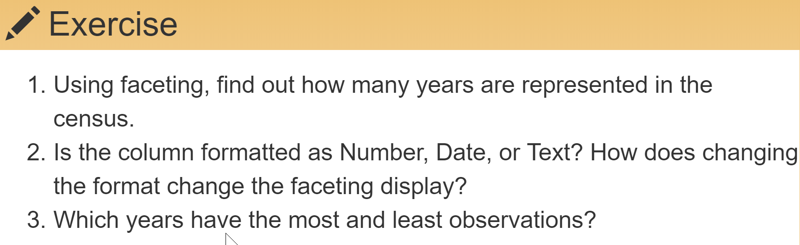
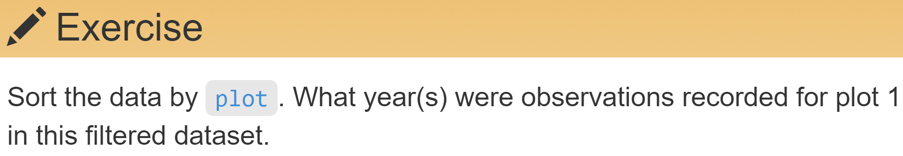
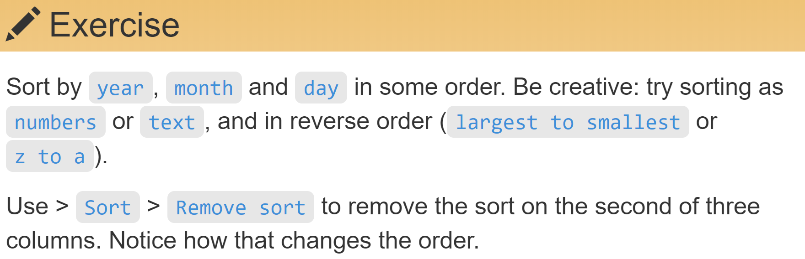
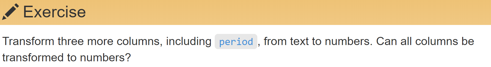
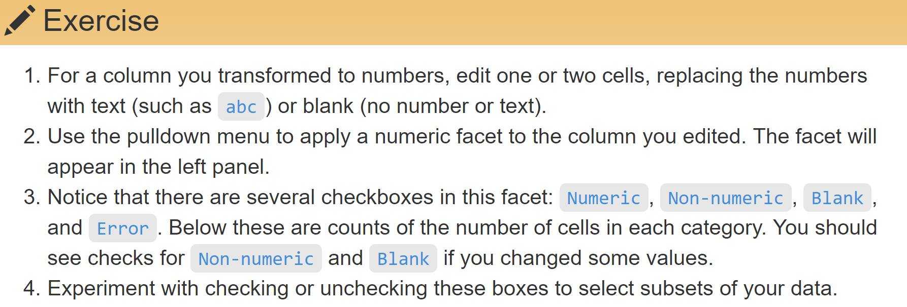
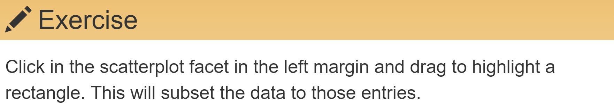
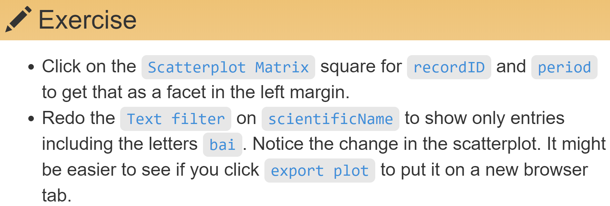
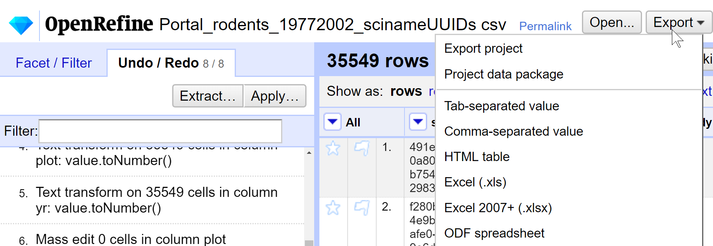

```{r setup, include=FALSE}
knitr::opts_chunk$set(
  echo = FALSE,
  collapse = TRUE
)
```

## [Schedule](https://datacarpentry.org/OpenRefine-ecology-lesson/)


# 1. Introduction | What is OpenRefine useful for?

Key points:

* Free, open source tool for data cleaning.
* Can do challenging cleaning easily.
* Tracks history automatically.


# 2. Working with OpenRefine (30')

* _How can we bring our data into OpenRefine?_
* _How can we sort and summarize our data?_
* _How can we find and correct errors in our raw data?_


# Demo Create project | Import Portal_rodents_19772002_scinameUUIDs.csv

* Play with preview.

# Demo Text facet on scientificName | Facet > Text facet

## 

* Sort by name and by count.

    * Can you spot any problem?

* Hover over names to reveal the edit function

    * Can fix something everywhere, then undo.


## 




# Demo clustering | finding alternative representations of the same thing

* Clean scientificName via clustering on the Text Facet.

    * Merge using metaphone3 (should identify three clusters)
    * Try different Methods but don’t Merge again (to stick to lesson)


# Demo split columns

* Split `scientificName` into genus and species.
    * Edit Column > Split into several columns...
    * replace the comma with a space.
    * Uncheck "Remove this column".

There is a problem with leading white space. See next.


# Demo trim whitespace

Fix it and repeat.


On scientificName: 

* Edit cells > Common transforms > Trim leading and trailing white space.
* Repeat split.

__Use undo / redo to leave the dataset unsplit__


## 


## Key points

Faceting and clustering approaches can identify errors or outliers in data.


# 3. Filtering and Sorting (20')

* _How can we select specific subsets of data?_
* _How can we sort our data?_


# Your turn | Filter scientificNames matching "bai"

* What happens if you type more characters?

* What happens if you click on: 
  * each species' name.
  * include / exclude


## Sorting by one column





## Sorting by multiple columns




## Key point

Sorting and filtering with Openrefine keeps raw data raw.


# 4. Examining Numbers in OpenRefine (10')

* _How can we convert a column from one data type to another?_
* _How can we visualize relationships among columns?_


## Change type | Change recordID to number

Edit cells > Common transforms… > To number

* Ensure you remove any facet.


## Numeric facet




## Numeric facet




## Scatterplot facet on recordID | Explore ralationship among numeric columns


##




##




## Key point

OpenRefine helps you overview numerical data.


# 5. Scripts from OpenRefine (15')

* _How can we document the data-cleaning steps we've applied to our data?_
* _How can we apply these steps to additional data sets?_


## Export scripts of your work history | Undo / Redo > Extract...

* OpenRefine scripts your history.
* You can extract and save it as plain text.


## Export scripts of your work history | Undo / Redo > Apply...

* You can apply stored cleaning steps to other datasets with the same structure.


## Key points

* You can reproduce your cleaning steps.

* You can publish in an appendix your data-cleaning steps.


# 6. Exporting and Saving Data (15') | How can we save and export our cleaned data from OpenRefine?


## Export clean datasets or entire projects




## Key points

You can export and share cleaned data, or entire projects.


# 7. Other Resources in OpenRefine | What other resources are available for working with OpenRefine?

[Learn more](https://datacarpentry.org/OpenRefine-ecology-lesson/06-resources/index.html)


# End | Have you installed the software for the next lesson?
