```{r setup, include=FALSE}
knitr::opts_chunk$set(
  echo = FALSE,
  collapse = TRUE
)
```

## Tentative schedule

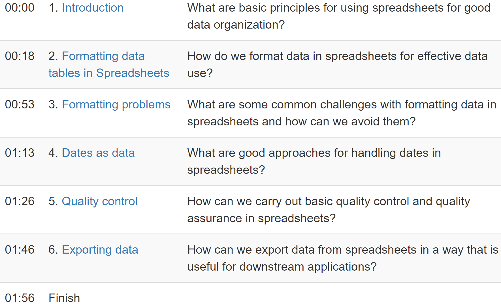


# 1. Introduction (18') | Principles for good data organization


## Exercise

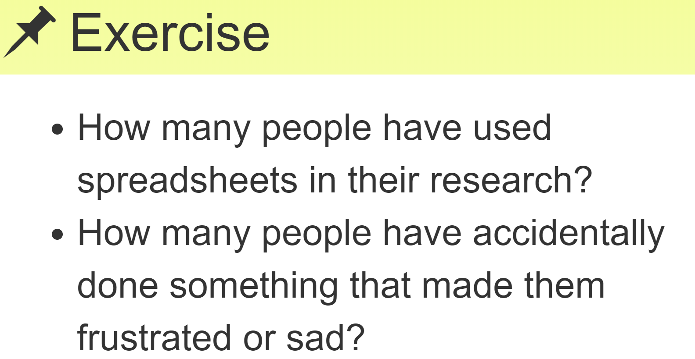


## What are spreadsheets good/bad for?

* Data entry.
* Organizing data.
* Subsetting and sorting data.
* Statistics.
* Plotting.


## Key point

* It is crucial to organize research data well.


# 2. Formatting data tables in Spreadsheets (35') | How to structure data so it is easy to work with


## Wide layout: Good to enter data | Example

* Each cell represents a count of individuals for a given combination of `plot` and `Sex`.

* The variable `sex` is implicit. It's values are spread along two columns `F` and `M`. 

```{r, message=FALSE}
library(tidyverse)

wide <- tibble::tribble(
  ~plot,  ~F,  ~M,
     1L, 11L, 12L,
     2L, 21L, 22L,
     3L, 31L, 32L
)
knitr::kable(wide)
```

## From wide to long, automatically | The key word here is automatically. Example in R:

```{r long-create, echo=TRUE}
long <- wide %>% 
  gather(key = "sex", value = "n", F:M)

long
```

## Long layout: Great for data analysis | Example in R

Take `long`, then group by `sex`, then sum the `n` of individuals.

```{r, eval=TRUE, echo=TRUE}
long %>% 
  group_by(sex) %>% 
  summarize(n = sum(n))
```


## Make your research reproducible | Track how you cleaned your data 

Automatically with googlesheets: File > Version history


## Make your research reproducible | Track how you cleaned your data 

Manually: Write cleaning steps in plain text (e.g. README.txt)

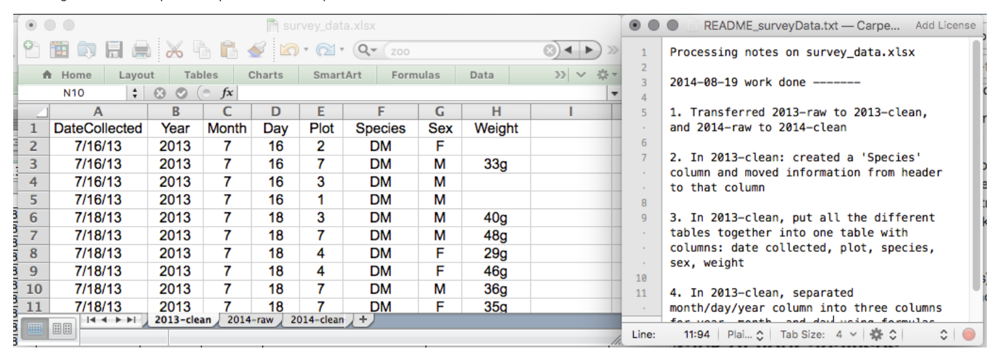


## Structuring data in spreadsheets | Tidy data ([Book chapter](http://r4ds.had.co.nz/tidy-data.html); [paper](http://www.jstatsoft.org/v59/i10))

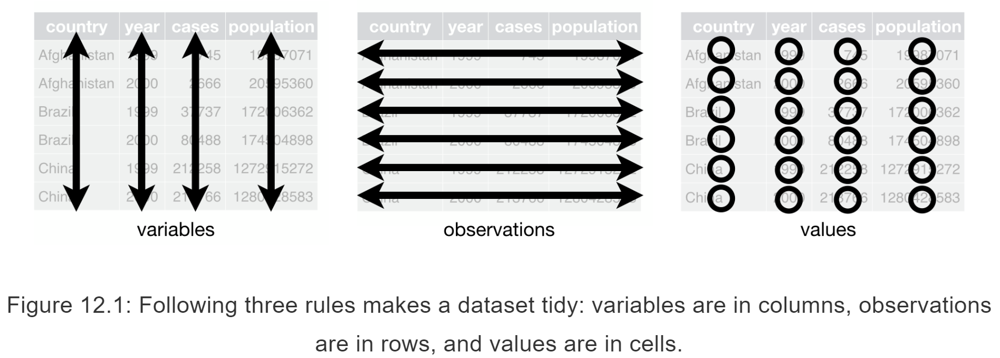  


## Is this a tidy dataset?

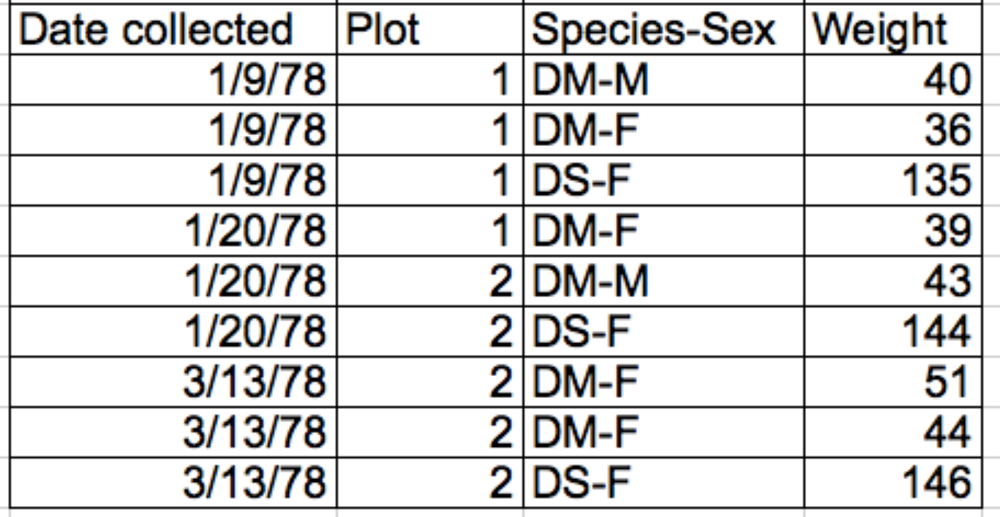


## Is this a tidy dataset?

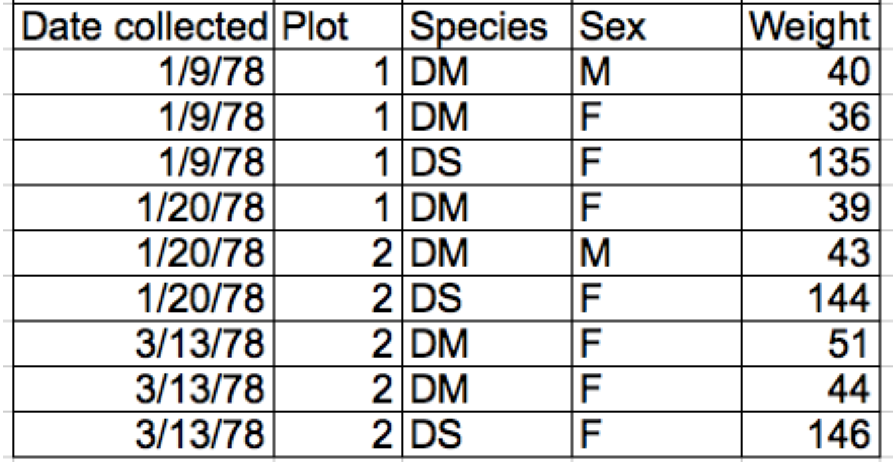


## Introduction to workshop data | ([source](https://datacarpentry.org/ecology-workshop/data/))

_Time-series for a small mammal community in southern Arizona to study the effects of rodents and ants on the plant community_

* Rodents sampled on 24 plots, with different treatments.

* Real dataset (used in over 100 publications).

* Slightly simplified for the workshop.


## Discussion

See next slide

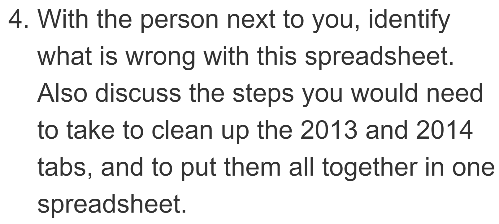

## Discussion

To work locally, download: 

<http://bit.ly/carpentries-spreadsheets-messy>, OR

To work online, File > Make a copy...:

<http://bit.ly/carpentries-googlesheets-messy>


## Key points

* Keep raw data raw.
* Track changes with an automated system or in plain text.
* Organize your data according to tidy data principles.


# 3. Formatting problems | Common formatting challenges and how to avoid them

See lesson.


## Learn more | Data organization in spreadsheets 

Broman KW, Woo KH. (2018) Data organization in spreadsheets. PeerJ Preprints 6:e3183v2 https://doi.org/10.7287/peerj.preprints.3183v2


# 4. Dates as data (13') | How to handle dates safely


## Exercise

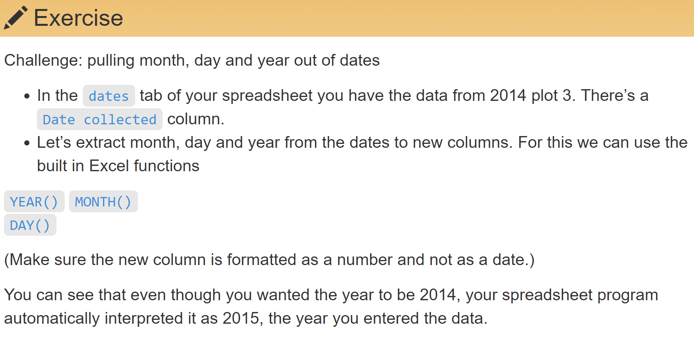

```{r}
# Format data with: 
#   Format > Number  > Number, OR
#   Format > Number  > More formats
```

## Solution

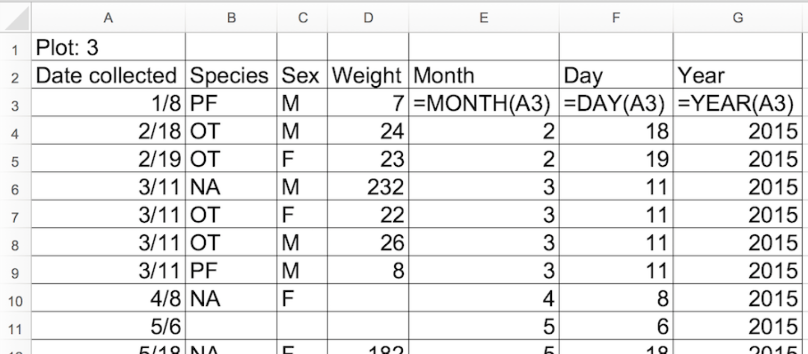


## Exercise

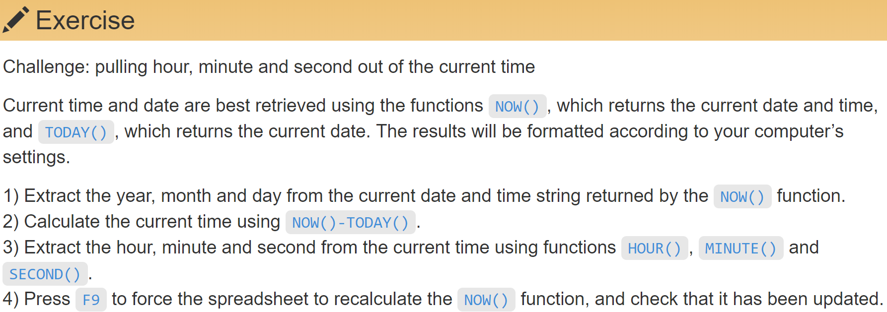

## Solution

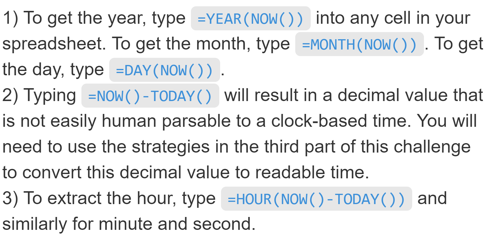


## How spreadsheets store dates?

Dates stored as integer: Number of days from 1899-12-31.

WARNING: Can't parse dates before 1899-12-31

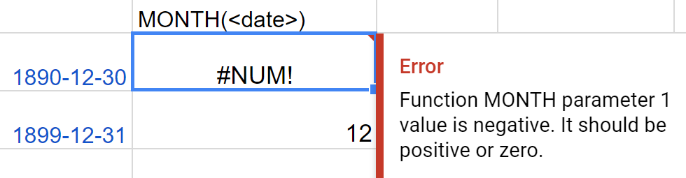


## Exercise

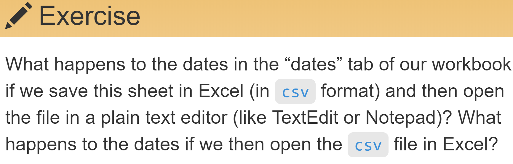

## Solution

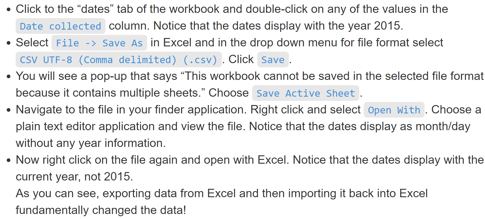


## Preferred date formats | Many programs like these formats

Date: 

* Clear and succint (1 column): `YYYY-MM-DD`
* Clear but not succint (3 columns): `YEAR`, `MONTH`, `DAY`
* Succint but unclear (1 column): `YYYYMMDD`.

Generalizing to date-time: `YYYYMMDDhhmmss`

Example in R:

```{r, echo=TRUE, message=FALSE}
library(lubridate)
as_datetime("20180923145108")
```


## Key point

Format dates for any program to interpret them correctly.


# 5. Quality control (5') | How to validate data to avoid errors

## Design a system to miminize errors

From [_be_pragmatic()_](https://bookdown.org/maurolepore/pragmatic/pragmatic.html#10)


## Demo data validation | [bit.ly/carpentries-googlesheets-messy](https://bit.ly/carpentries-googlesheets-messy)

Cell range may be defined in another sheet

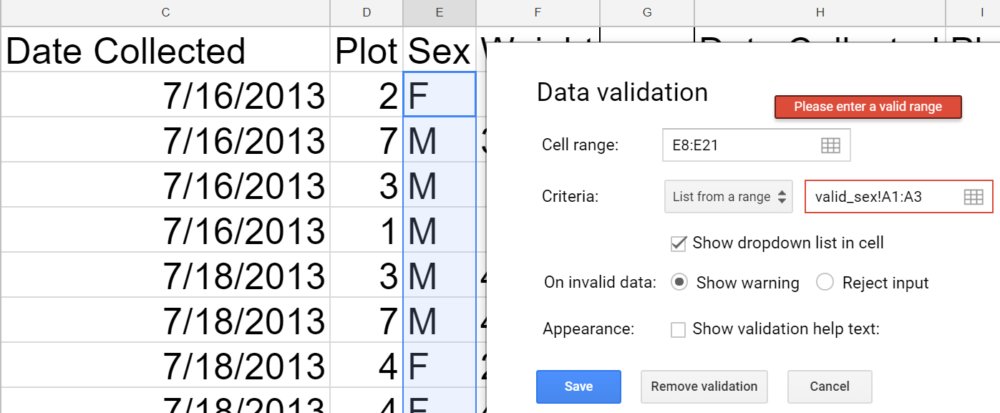


## Demo data validation | You can protect sheets and cells

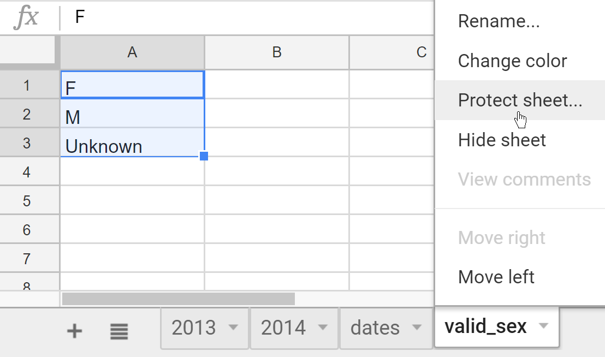


## Demo data validation | Others can request changes via comments

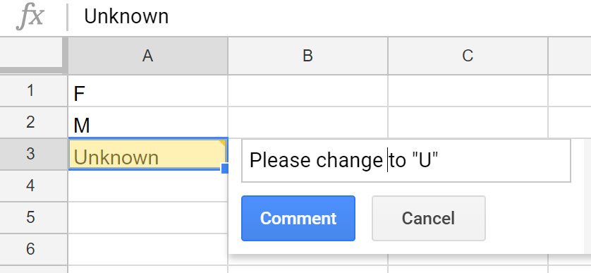


## Key points

* You can control what type of data gets entered.

* You can explore invalid data with sorting.

* You can flag invalid data with conditional formatting.


# 6. Exporting data (10') | How to export data to maximize downstream applications

## Export a spreadsheet as a .csv file 

In googlesheets: 

File > Download as > Comma-separated values (.csv, current sheet)

__When whould you export Tab-separated values (.tsv)?__


## Key points

Export data to plain text formats (.csv, .tsv).


# End | Have you installed the software for the next lesson?

