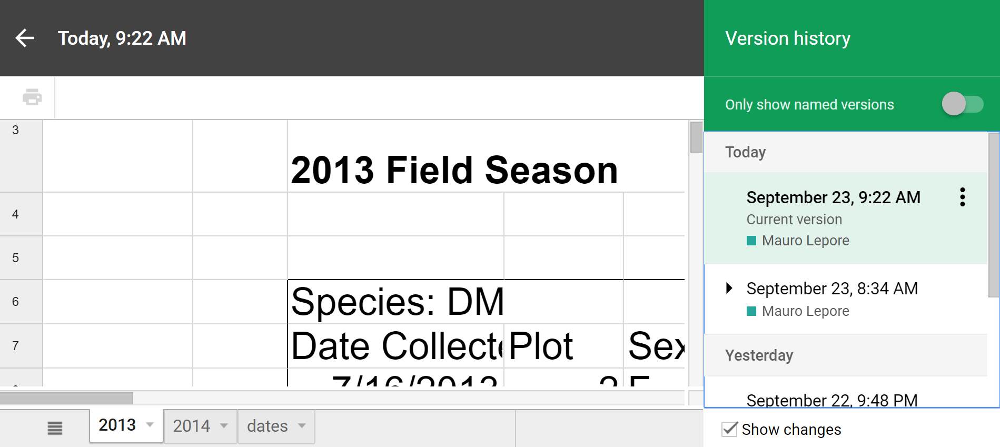

```{r setup, include=FALSE}
knitr::opts_chunk$set(
  echo = FALSE,
  collapse = TRUE
)
```

## [Schedule](https://datacarpentry.org/spreadsheet-ecology-lesson/)


# 1. Introduction (15') | _What are basic principles for using spreadsheets for good data organization?_


# Poll

### Who has ever used spreadsheets?
### Who has ever struggled using spreadsheets?


# Good or bad for what?

* Data entry.
* Organizing data.
* Subsetting and sorting data.
* Statistics.
* Plotting.


# 2. Formatting data tables in Spreadsheets (15') | _How do we format data in spreadsheets for effective data use?_

> The best layouts ... for data entry and data analysis might be different. 

> It is important to ... automate the conversion from one to another.


## Wide layout | Best for data entry

```{r, message=FALSE}
library(tidyverse)

wide <- tibble::tribble(
  ~plot,  ~F,  ~M,
     1L, 11L, 12L,
     2L, 21L, 22L,
     3L, 31L, 32L
)

wide %>% knitr::kable()
```

## From wide to long, automatically in R

```{r long-create, echo=TRUE}
long <- wide %>% 
  gather(key = "sex", value = "n", F:M)

long
```

## Long layout | Best for data analysis, e.g.:

Take `long`, then group by `sex`, then sum the `n` of individuals.

```{r, eval=TRUE, echo=TRUE}
long %>% 
  group_by(sex) %>% 
  summarize(n = sum(n))
```


## Make your research reproducible | Track how you cleaned your data 

Automatically with googlesheets: File > Version history




## Make your research reproducible | Track how you cleaned your data 

Manually: Write cleaning steps in plain text (e.g. README.txt)


## Structuring data in spreadsheets | Tidy data? ([Book chapter](http://r4ds.had.co.nz/tidy-data.html); [paper](http://www.jstatsoft.org/v59/i10))

  


## Is this data tidy?


## Is this data tidy?


## Workshop data | ([source](https://datacarpentry.org/ecology-workshop/data/))

_Time-series for a small mammal community in southern Arizona to study the effects of rodents and ants on the plant community_

* Rodents sampled on 24 plots, with different treatments.

* Real dataset (used in over 100 publications).

* Slightly simplified for the workshop.


# Your turn | Put together data from 2013 and 2014 tabs (10')

To work locally, download: 

<http://bit.ly/carpentries-spreadsheets-messy>, OR

To work online, File > Make a copy...:

<http://bit.ly/carpentries-googlesheets-messy>


## Key points

* Keep raw data raw.
* Track changes with an automated system or in plain text.
* Organize your data according to tidy data principles.


# 3. Formatting problems (skip) | What are some common challenges with formatting data in spreadsheets and how can we avoid them?


## Learn more | Data organization in spreadsheets 

Broman KW, Woo KH. (2018) Data organization in spreadsheets. PeerJ Preprints 6:e3183v2 https://doi.org/10.7287/peerj.preprints.3183v2


# 4. Dates as data (10') | What are good approaches for handling dates in spreadsheets?


##


```{r}
# Format data with: 
#   Format > Number  > Number, OR
#   Format > Number  > More formats
```

##


## How spreadsheets store dates?

Dates stored as integer: Number of days from 1899-12-31.

WARNING: Can't parse dates before 1899-12-31


##


## Preferred date formats | Other programs like these formats

Date: 

* Clear and succint (1 column): `YYYY-MM-DD`
* Clear but not succint (3 columns): `YEAR`, `MONTH`, `DAY`
* Succint but unclear (1 column): `YYYYMMDD`.

Generalizing to date-time: `YYYYMMDDhhmmss`

Example in R:

```{r, echo=TRUE, message=FALSE}
library(lubridate)
as_datetime("20180923145108")
```


## Key point

Format dates so that they are easy to handle.


# 5. Quality control (5' Optional) | How can we carry out basic quality control and quality assurance in spreadsheets?


# Demo | Data validation (5') | bit.ly/carpentries-googlesheets-messy

## Demo data validation | Cell range may be from other sheet


## Demo data validation | You can protect sheets and cells


## Demo data validation | Others can request changes via comments


## Key points

* You can control what type of data gets entered.

* You can explore invalid data with sorting.

* You can flag invalid data with conditional formatting.


# 6. Exporting data (10') | How can we export data from spreadsheets in a way that is useful for downstream applications?

# Your turn | Export a spreadsheet as a .csv file.

In googlesheets: 

File > Download as > Comma-separated values (.csv, current sheet)


# ? | When whould you export Tab-separated values (.tsv)?


## Key points


Export data from spreadsheets to formats plain text (.csv, .tsv) format.


# End | Have you installed the software for the next lesson?

