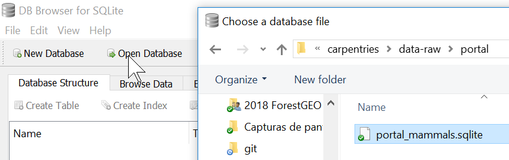
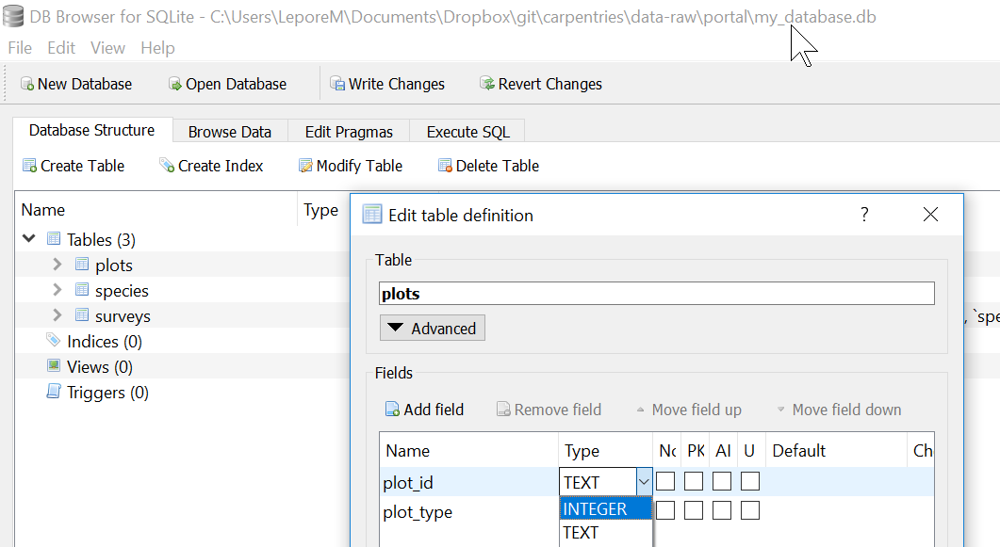

```{r setup, include=FALSE}
knitr::opts_chunk$set(
  echo = FALSE,
  collapse = TRUE
)
```

## Tentative schedule


# 1. Databases using SQL (65')

* What is a relational database and why bother? 
* What is SQL?


## Challenge


## Solution

Open and explore each file with the previous questions in mind.


## Relational data

Database: Collection of tables connected via some value.

Table; record (= observation = row); field (= column); key; unique identifier; entry (value). 

[Source](http://r4ds.had.co.nz/relational-data.html)


## Explore a database



## Explore a database

Explore all tabs. In _Database Structure_:

* Do types vary across columns of a table?
* Do types vary across rows of a column?
    


## Design

Is data redundant?

* Why would you design a database that way?
* How you can design a database to achieve that?


## Exercise | Create a new database importing .csv files



## Exercise | Create a new database importing .csv files

Menu:

* _File > New Database_.

* _File > Import > Table from CSV file..._.
    * Import: surveys.csv, species.csv, plots.csv
    
* _Modify Table_

    * use INTEGER, REAL and TEXT (see next slide or [lesson](https://datacarpentry.org/sql-ecology-lesson/00-sql-introduction/index.html)).

## Exercise | Column types


## Key point

* A database is a collection of tables related to each other by shared keys.


## Bonus: A database in sheets


## Bonus: A database in R

```{r, echo = TRUE, message=FALSE}
library(here)
library(tidyverse)
```

Easiest is to work directly with the .csv files.

```{r, echo=TRUE, message=FALSE}
plots   <- read_csv(here("plots.csv"))
species <- read_csv(here("species.csv"))
surveys <- read_csv(here("surveys.csv"))
```

## Bonus: A database in R

```{r, echo=TRUE}
surveys 
```

## Bonus: Using an database connection from R | Connecting to the database

If you already have a database, you can also use it.

```{r, echo=TRUE, message=FALSE}
path <- here("data-raw/portal/portal_mammals.sqlite")
db <- DBI::dbConnect(RSQLite::SQLite(), path)
```

## Bonus: Using an database connection from R | Queries with SQL from rmarkdown (R)

Using these chunk options:

`{sql, engine = "sql", connection = "db"}`

```{sql, echo = TRUE, engine = "sql", connection = "db"}
SELECT record_id, plot_id, species_id, sex
FROM surveys
```


## Bonus: Using an database connection from R | Queries with R via R-SQL objects

Creating special tables to query the database.

```{r, echo=TRUE, message=FALSE}
plots_db   <- tbl(db, "plots")
species_db <- tbl(db, "species")
surveys_db <- tbl(db, "surveys")

class(surveys_db)
```

## Bonus: Using an database connection from R | Queries with R via R-SQL objects

```{r, echo=TRUE}
surveys_db
```


# 3. SQL Aggregation and aliases (60')

* How can I summarize my data by aggregating, filtering, or ordering query results? 

* How can I make sure column names from my queries make sense and aren’t too long?


## `COUNT`, ` MAX`, `MIN`, and `AVG` | Some of the simplest, most informative summaries

```sql
SELECT COUNT(*)
FROM surveys;
```

```sql
SELECT COUNT(*), SUM(weight)
FROM surveys;
```


## Challenge


## Solution

```sql
-- All animals
SELECT SUM(weight), AVG(weight), MIN(weight), MAX(weight)
FROM surveys;

-- Only weights between 5 and 10
SELECT SUM(weight), AVG(weight), MIN(weight), MAX(weight)
FROM surveys
WHERE (weight > 5) AND (weight < 10);
```


## Grouped summaries with `GROUP BY`

```sql
SELECT species_id, COUNT(*)
FROM surveys
GROUP BY species_id;
```


## Challenge


## Solution

Solution of 1

```sql
SELECT year, COUNT(*)
FROM surveys
GROUP BY year;
```

Solution of 2 and 3

```sql
SELECT year, species_id, COUNT(*), AVG(weight) 
FROM surveys
GROUP BY year, species_id;
```


## `ORDER BY` a summary column

```sql
SELECT species_id, COUNT(*)
FROM surveys
GROUP BY species_id
ORDER BY COUNT(species_id);
```


## Clarify column names with `AS` <alias>

```sql
SELECT MAX(year) AS last_surveyed_year
FROM surveys;

SELECT MAX(year) last_surveyed_year
FROM surveys;
```

`AS` is optional. This also works (but isn't "good" style)

```sql
SELECT MAX(year) last_surveyed_year
FROM surveys;
```


## `GROUP BY <cols> HAVING <cond>` | Filter results of aggregate functions

`HAVING` ~ `WHERE`:

* `<columns> WHERE <condition>`
* `<results> HAVING <condition>`

## `GROUP BY <cols> HAVING <cond>` | Filter results of aggregate functions

```sql
SELECT species_id, COUNT(species_id)
FROM surveys
GROUP BY species_id
-- "Smells" a bit
HAVING COUNT(species_id) > 10;

-- Same but nicer 
SELECT species_id, COUNT(species_id) AS n
FROM surveys
GROUP BY species_id
HAVING n > 10;
```

<http://rstd.io/code-smells> (Jenny Bryan)


## Challenge


## Solution

```sql
SELECT taxa, COUNT(*) AS n
FROM species
GROUP BY taxa
HAVING n > 10;
```


## `CREATE VIEW viewname AS` | Store and reuse queries

```sql
SELECT *
FROM surveys
WHERE year = 2000 AND (month > 4 AND month < 10);
```

Store

```sql
CREATE VIEW summer_2000 AS
SELECT *
FROM surveys
WHERE year = 2000 AND (month > 4 AND month < 10);
```

Reuse

```sql
SELECT *
FROM summer_2000
WHERE species_id == 'PE';
```


## Be careful with `NULL` values 


```sql
-- 45 individuals which sex is of NULL sex
SELECT sex, COUNT(*)
FROM summer_2000
GROUP BY sex

-- As you expect, excludes NULL
SELECT COUNT(*)
FROM summer_2000
-- Excludes NULL
WHERE sex == 'F'

-- But tally includes NULL: 366 + 382 + 45 = 793
SELECT COUNT(*)
FROM summer_2000
```


## Key points

* Use `MIN`, `MAX`, `AVG`, `SUM`, `COUNT`, etc. to operate on aggregated data.

* Use `AS` to create aliases.

* Use `HAVING` to filter on aggregate properties (similar to `WHERE`).

* Use `CREATE VIEW` to store a query.


## Bonus: Aggregation and aliases

```{r, echo=TRUE}
surveys %>% 
  group_by(species_id) %>% 
  summarize(n = n()) %>% 
  filter(n > 10)
```

## Bonus: Aggregation and aliases

`count()` is so common that has a shortcut

```{r}
surveys %>% 
  # group_by(species_id) %>% 
  # summarize(n = n()) %>% 
  count(species_id) %>% 
  filter(n > 10)
```


# 4. Joins (25') | How do I bring data together from separate tables?


## `JOIN <table> USING <(columns)>`

```sql
SELECT *
FROM surveys
JOIN species
ON surveys.species_id = species.species_id;
```

Same, when column names match.

```sql
SELECT *
FROM surveys
JOIN species
-- Same column name in both tables
USING (species_id);
```


## Challenge


## Solution

```sql
SELECT species.genus, species.species, surveys.weight
FROM surveys
JOIN species
ON surveys.species_id = species.species_id;
```

Same

```sql
SELECT genus, species, weight
FROM surveys
JOIN species
USING (species_id)
```


## `<kind of> JOIN` 

`INNER JOIN` = `JOIN`: Keeps all rows that match in both tables

```sql
SELECT * 
FROM surveys
INNER JOIN species
USING (species_id);
```

`LEFT JOIN`: Keeps all rows that match in left table

("left" is closest to `FROM`)

## Challenge


## Solution

```sql
SELECT * 
FROM surveys
LEFT JOIN species
USING (species_id);
```


## Compute on `JOIN`ed results | And a note on style

Left table implicit: Drives attention to `surveys.weight`.

```sql
SELECT plot_type, AVG(surveys.weight)
FROM plots
JOIN surveys
USING (plot_id)
GROUP BY plot_type;
```

Same but buries intention.

```sql
SELECT plots.plot_type, AVG(surveys.weight)
FROM surveys
JOIN plots
ON surveys.plot_id = plots.plot_id
GROUP BY plots.plot_type;
```


## Challenge


## Solution

```sql
SELECT plot_id, genus, COUNT(*) AS n
FROM surveys
JOIN species
USING (species_id)
GROUP BY genus, plot_id
ORDER BY plot_id ASC, n DESC;
```


## `IFNULL(<column>, <value>)` | To "fill" `NULL` values

```sql
SELECT species_id, sex, IFNULL(sex, 'U')
FROM surveys;
```


## Challenge


## Solution

```sql
SELECT hindfoot_length, IFNULL(hindfoot_length, 30)
FROM surveys;
```


## Challenge


## Solution

```sql
SELECT species_id, AVG(IFNULL(hindfoot_length,30))
FROM surveys
GROUP BY species_id;
```


## `NULLIF(<column>, <value>)` | to "null out" specific values


`NULLIF` is the inverse of `IFNULL`. 

Returns `NULL` 

If the first argument is equal to the second argument it returns `NULL`.

Else, it returns the original value.

```sql
SELECT species_id, plot_id, NULLIF(plot_id, 7)
FROM surveys;
```


## There are many more functions | Example: 


## Challenge


## Solution

```sql
SELECT genus, LENGTH(genus)
FROM species
ORDER BY LENGTH(genus) DESC
```


## Key points

* Use `JOIN <table> USING <(common column)>` to combine data from two tables.

* Use `(INNER) JOIN` to keep rows that match on both tables; or `LEFT JOIN` to keep all rows of the left table and the matching rows of the right table.

* Use `IFNULL(<column>, <value>)` to "fill" `NULL` values; and `NULLIF(<column>, <value>)` to "null out" specific values.

* Use other functions e.g. `LENGTH(<column>)` to operate on individual values.


## Bonus: Joins in R

```{r, echo=TRUE}
plots %>%
  left_join(surveys) %>% 
  group_by(plot_type) %>% 
  mutate(mean_weight = mean(weight, na.rm = TRUE)) %>% 
  select(plot_type, mean_weight) %>% 
  unique()
```


# End
