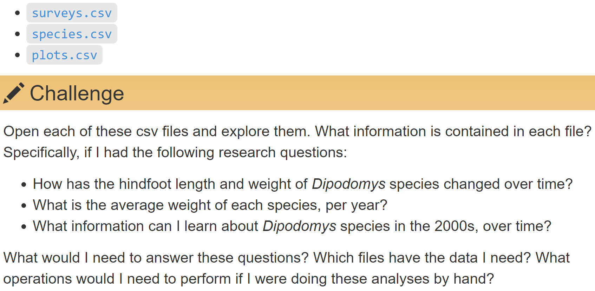

```{r setup, include=FALSE}
knitr::opts_chunk$set(
  echo = FALSE,
  collapse = TRUE
)
```

## [Schedule](https://datacarpentry.org/sql-ecology-lesson/)


# 1. Databases using SQL (65')

* What is a relational database and why should I use it? 
* What is SQL?


##




## Relational data

Database: Collection of tables connected via some value.

Table; record (= observation = row); field (= column); key; unique identifier; entry (value). 

[Source](http://r4ds.had.co.nz/relational-data.html)


## Explore a database | DB Browser for SQLite

Open Database > portal_mammals.sqlite

Explore tables and tabs:

* _Database Structure_.
    * Do types vary across columns of a table?
    * Do types vary across rows of a column?
* _Browse Data_.
* Execute SQL.


## Design

Is data redundant?

* Why would you design a database that way?
* How you can design a database to achieve that?


# Your turn | Create a new database importing .csv files

##

Menu:

* _File > New Database_.

* _File > Import > Table from CSV file..._.
    * Import: surveys.csv, species.csv, plots.csv
    
* _Modify Table_

    * use INTEGER, REAL and TEXT (see next slide or [lesson](https://datacarpentry.org/sql-ecology-lesson/00-sql-introduction/index.html)).

## 


## Key point

* A database is a collection of tables related to each other by shared keys.


# 2. Basic Queries (35') | How do I write a basic query in SQL?


## `SELECT <columns> FROM <table>` | different ways

```sql
SELECT *
FROM surveys;
```

```sql
SELECT year, month, day
FROM surveys;
```

```sql
SELECT surveys.year, surveys.month, surveys.day
FROM surveys;
```


## Syle | _Execute SQL_ (Cmd-Enter/Ctrl-Enter)

Good

```sql
SELECT year
FROM surveys;
```

Bad

```sql
select year from surveys;
```


## `LIMIT` and `DISTINCT`

```sql
SELECT *
FROM surveys
LIMIT 10;
```

```sql
SELECT DISTINCT species_id
FROM surveys;
```


## Calculated values | `+`, `-`, `*`, `/`, and `ROUND(<what?>, <integer>)`

```sql
SELECT year, month, day, weight / 1000
FROM surveys;
```

```sql
SELECT plot_id, species_id, sex, weight, ROUND(weight / 1000, 2)
FROM surveys;
```


## `<INTEGER> / 1000`

Change `weight` to integer:

* _Database Structure > surveys > Modify Table_ to INTEGER

```sql
SELECT weight / 1000
FROM surveys
```

```sql
SELECT weight / 1000.00
FROM surveys
```

Change back


## Challenge


## Solution

```sql
SELECT day, month, year, species_id, weight * 1000
FROM surveys;
```


## Filtering with `WHERE`

```sql
SELECT *
FROM surveys
WHERE species_id='DM';
```

```sql
SELECT * FROM surveys
WHERE year >= 2000;
```


## Multiple conditions: `AND`, `OR`, and `IN`

```sql
SELECT *
FROM surveys
WHERE (year >= 2000) AND (species_id = 'DM');
```

```sql
SELECT *
FROM surveys
WHERE (species_id = 'DM') OR (species_id = 'DO') OR (species_id = 'DS');

-- Same as above. BTW, I'm a comment :)
SELECT *
FROM surveys
WHERE species_id IN ('DM', 'DO', 'DS');
```


## Challenge


## Solution

```sql
SELECT day, month, year, species_id, weight / 1000
FROM surveys
WHERE (plot_id = 1) AND (weight > 75);
```


## Sorting: `ORDER BY <column> ASC/DESC`

```sql
SELECT *
FROM species
ORDER BY taxa ASC;
```

```sql
SELECT *
FROM species
ORDER BY taxa DESC;
```

```sql
SELECT *
FROM species
-- ASC is implicit (default).
ORDER BY genus, species;
```


## Challenge


## Solution

```sql
SELECT year, species_id, weight / 1000
FROM surveys
ORDER BY weight DESC;
```


## Challenge


## Solution

```sql
SELECT year, month, day, species_id, ROUND(weight / 1000, 2)
FROM surveys
WHERE year = 1999
ORDER BY species_id;
```


## Key points

* "Good" style and comments make your code easier to understand.
* SQL helps you select columns, filter and order rows
* Pick specific rows using conditions with `AND`, `OR` and `IN`.
* Compute on column values with arithmetic operators.


# 3. SQL Aggregation and aliases 

* How can I summarize my data by aggregating, filtering, or ordering query results? 
* How can I make sure column names from my queries make sense and aren’t too long?


# 4. Joins | How do I bring data together from separate tables?


# End | Have you installed the software for the next lesson?
